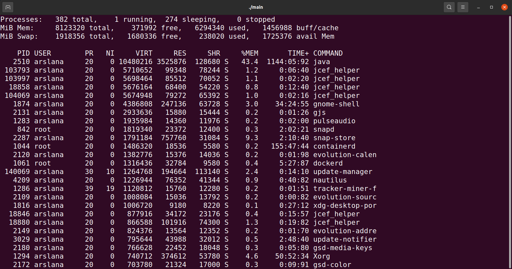
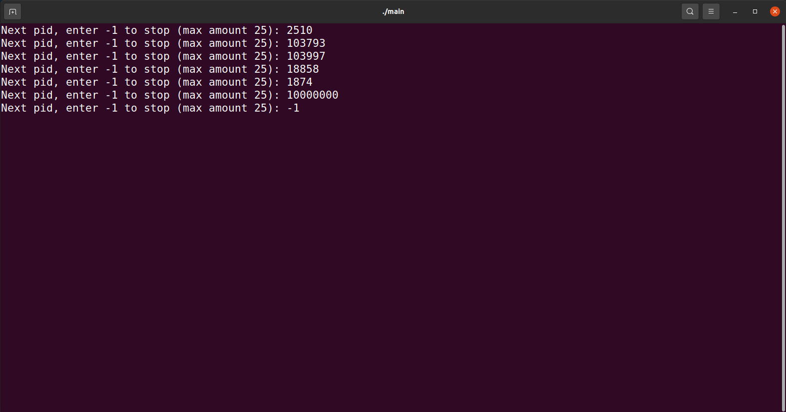
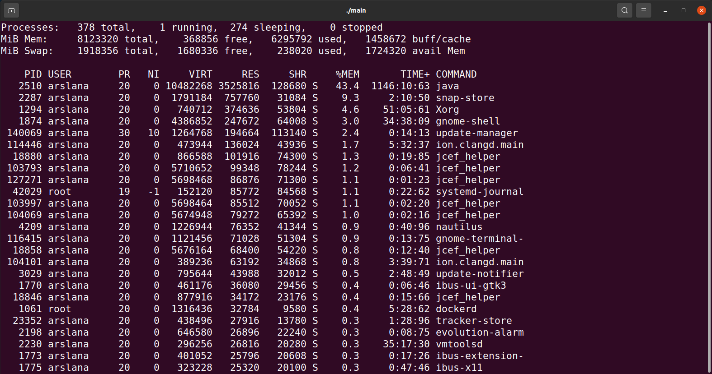

# Project2 Final Document

<div align=center>11811311 Enhuai Liu<br>11811535 Shangxuan Wu</div>

## Result Analysis

### Realize Real-time Statistics of Memory Usage

In the design document, we expect to

1. display information such as pid and three types of memory (physical, swap, and virtual memory) for  for each process.
2. provide the percentage of physical memory usage and process sorting functions.

So far, we have achieved **all the expected goals** in the design documents. The specific interface is shown in the FIGURE 1. In process mode, each row in the table represents a process. Column `PID`, `USER`, `PR`, `NI`, `TIME+` and `COMMAND` show information about pid, owner, priority, nice value, total CPU time and name. Column `VIRT`, `RES`, and `SHR` contain the virtual, physical and swap memory information of processes respectively. Column `%MEM` shows the percentage of the process’s physical memory usage.



<center><b>FIGURE 1</b> Process mode of Memory Usage</center>

In addition to the above plan goals, we have also **implemented six enhancements**.

1. The first line in FIGURE 1 shows the global process operation, and the second and third lines show the global memory information. Running status of each process is also shown in the eighth column.

2. Input `p` of `P` to enter specific processes user want to monitor. Process will not be shown if the input process does not exist. An example is shown in FIGURE 2.

   

   

   <center><b>FIGURE 2</b> Process Selection</center>

3. Input `t` or `T` to monitor threads of one process. First line will be replaced to statistics of thread running status. An example is shown in FIGURE 3.

   

   

   <center><b>FIGURE 3</b> Thread Mode</center>

4. Input `d` or `D` to change interval of refreshing.

5. Input `o` or `O` to change the type of memory used by sorting. FIGURE 1 sorting using `VIRT` while FIGURE 4 sorting using `RES`.

   

   

   <center><b>FIGURE 4</b> Sort by RES</center>

6. Input `h` or `H` to view a help page, which is shown in FIGURE 5.

   

   <center><b>FIGURE 5</b> Help Page</center>

### Realize Detection of Memory Allocation and Release

In the design document, we plan to implement detection of memory allocation and release in two steps: 

1. Implement a static version, whenever memory allocation or deallocation occur, relevant information will be recorded, after program finished, users can see the detailed information.
2. Implement a dynamic version, whenever memory allocation or deallocation occur, real-time relevant information will be recorded and  shown to users.

So far, we have achieved **all the expected goals** in the design documents. As **FIGURE 6** shows, our program can dynamically print allocation/free, address, size, and time information to users while the target process is running.


<center><b>FIGURE 6</b> Real-time Memory Usage Detection</center>

Furthermore, when the target process finished, more detailed backtrace information will be shown in a log file as **FIGURE 7** shows.


<center><b>FIGURE 7</b> Detailed Memory Usage Information</center>

### Realize Detection of Memory Leaks

In the design document, we plan to implement detection of memory leaks in two steps: 

1. Implement a static version, whenever memory allocation or deallocation occurs, relevant information will be recorded, after program finished, out program analyse these information and let users see whether the memory occurred.
2. Implement a dynamic version, whenever memory allocation or deallocation occurs, real-time relevant information will be recorded and analysed. let our program show detailed information to users when it asserts memory leak occurs.

So far, we have achieved **all the expected goals** in the design documents.  As **FIGURE 8** shows, our program can dynamically print detailed memory leak information to users while the target process is running.


<center><b>FIGURE 8</b> Detailed Memory Leak Information</center>

However, it is impossible to truly judge memory leak before the target process finished, so those real-time information is for reference only. We still need a static version to show whether memory leak truly occurs, so our program will also analyse memory usage after the whole target process finished, as **FIGURE 9** shows.


<center><b>FIGURE 9</b>  Correct Memory Leak Information</center>

## Implementation

### Realize Real-time Statistics of Memory Usage

Information of global physical memory and swap memory can be get by analyzing `/proc/meminfo` and `/proc/vmstat`. They are stored in global variables with type `std::unordered_map`.

Traverse the `/proc` or `/proc/[pid]/task` folder helps us get all the currently existing processes or threads. To get information of processes, I read two files for each process: `/proc/[pid]/stat` and `/proc/[pid]/statm`. The first file contains information such as running status, and the second file contains memory usage. Similarly, same kind of information of threads can be obtained from `/proc/[pid]/task/[tid]/stat` and `/proc/[pid]/task/[tid]/statm`. A struct of processes and threads `program` is created to store information above using `std::unordered_map`.

```c++
struct program {
    std::string id;
    std::unordered_map<std::string, int> statm; // information in stat file
    std::unordered_map<std::string, std::string> stat; // information in statm file
    int nice; // nice value
};
```

While getting top-R processes or threads, we use `std::priority_queue` with a custom comparator  struct `compare_process`. It specify the type of memory used for sorting by acquiring parameter `field`.

```c++
struct compare_process {
    int field; // specify the type of memory used for sorting
    bool operator()(const program &lhs, const program &rhs) const {
        return lhs[field] > rhs[field];
    }
};
```

In main function, we obtain top-R threads or processes periodically and print them on the screen. If it detects that there is input in the input buffer, main function jumps out of the loop to process the input, and then re-enters the loop. The pseudo code is as follows.

```c++
int main(){
	while(true){
		while(has no input){
			get_global_mem_info();
			get_top_R_mem_info(int r);
			print();
		}
		// logic corresponding to the input
		sleep(t);
	}
}
```

### Realize Detection of Memory Allocation and Release

In order to detect real-time memory usage, we hooked 3 functions in C library: `malloc()`, `realloc()` and `free()` by shared object. Therefore, we can use our functions to replace  true `malloc()`, `realloc()` and `free()` by modifying environment variable `LD_PRELOAD`.

Fortunately, Linux source code has already  provided hook interfaces for these 3 functions, so we just hook these 3 functions: `__free_hook`, `__malloc_hook` and `__realloc__hook`. In this way, we can easily enable/disable our hook functions.

```c
// molloc.h
/* Hooks for debugging and user-defined versions. */
extern void (*__MALLOC_HOOK_VOLATILE __free_hook) (void *__ptr,
                                                   const void *)
__MALLOC_DEPRECATED;
extern void *(*__MALLOC_HOOK_VOLATILE __malloc_hook)(size_t __size,
                                                     const void *)
__MALLOC_DEPRECATED;
extern void *(*__MALLOC_HOOK_VOLATILE __realloc_hook)(void *__ptr,
                                                      size_t __size,
                                                      const void *)
```

Here is the pseudo code of `malloc()` detection(C style): when the process enter the hook function, we firstly disable the hook function and then call the original `malloc()` function to get the correct result, secondly record the relevant  information and show it to users, finally re-enable the hook function and return the result.

```c
static void * my_malloc_hook (size_t size, const void *caller)
{
    void *result = NULL;
    memory_hook_disable(); 
    result = malloc (size);
    record_info(result);
    info_show(result);
    memory_hook_enable(); 
    return result;
}
```

We implement `__free_hook` and `__realloc__hook` in the same way.

```c
static void my_free_hook (void *ptr, const void *caller)
{
    memory_hook_disable();  
    free (ptr);
    record_info(ptr);
    info_show(ptr);
    memory_hook_enable();
    return;
}
static void *my_realloc_hook (void *ptr, size_t size, const void *caller)
{
    void* result = NULL;
    memory_hook_disable(); 
    result = realloc (ptr, size);
    record_info(result);
    info_show(result);
    memory_hook_enable(); 
    return result;
}
```

### Realize Detection of Memory Leaks

In this part, we should make full use of memory usage information from previous detection. Sine it is impossible to truly judge memory leak before the target process finished, so our dynamic methods can not truly identify memory leak, while it just takes the memory as leak if it lives longer than time-threshold or count-threshold. The default time-threshold is 1000 clocks and the default count-threshold is 256.

Here is the pseudo code of dynamic memory leak detection: periodically call function `MEMORY_LEAK_CHECK` can show  real-time leak information to users. 

```C
static void *MEMORY_LEAK_CHECK()
{
    for (each address in memory alocation and release addresses){
        if(this address is not freed/reallocted longer than time-threshold){
            assert mem-leak occurs;
            leak_show();
        } 
        if(this address is not freed/reallocted longer than count-threshold){
            assert mem-leak occurs;
            leak_show();
        } 
    }
}
```

Furthermore, we should give the correct leak information after target process finished, here is the pseudo code: 

```c
static void *MEMORY_LEAK_CHECK_FINAL()
{
	if(target process finished){
        if(unfreed_addresses_list.length > 0){
            assert mem-leak occurs;
        }
        else{
            assert mem-leak never occurs;
        }
        leak_show();
    }
}
```

## Future Direction

### Realize Real-time Statistics of Memory Usage

1. Real-time calculation of CPU occupancy rate and the corresponding sorting comparator can be added to show the scheduling of the process more intuitively.

2. In order to respond more quickly to the letter instructions entered on the command line, multiple threads can be added to handle the display of thread memory and the interaction with the command line respectively. Through that, the commands on the command line will also be responded to the first time during the sleep period of the program.

3. Change the command line display to the web page display, which is not only more beautiful, but also easier to add more interactive component.

### Realize Detection of Memory Allocation and Release

1. In our current implementation, each time memory allocation or release occurs, our program will print the information for users, which lead to frequent IO operations. We plan to optimize it by using additional buffer to store print information and then periodically print it from buffer.

### Realize Detection of Memory Leaks

1. In our current implementation, we just use list and array to store memory usage information, which makes the time complexity of leak-detect function reach O(n). We plan to use some better data structure to reduce time complexity.
2. Since we can only show the back-trace information, which is hard for human understanding. Users should use both leak back-trace information and file `target-program.map` to find related lines of code. We plan to translate back-trace information to related lines of code inside our program.

## Summary

From this project, I learned three aspects of technology.

1. We have a better understanding of the environment configuration, file system details, processes, and thread organization of the Linux system. In addition, I am more familiar with the implementation of command-line related functions.
2. We have learned about situations of memory leaks in the C++ development process, and have an in-depth understanding memory-related functions such as `malloc` and memory allocation mechanisms. We are aware of the importance of memory detection and memory leak detection for the development of C++ programs, and know how to develop compliant code.
3. In the process of using C++ to complete the project, we used more system calls and library functions, learned about the relevant code specifications, and gained a deeper understanding of the C++ language.

The experience of teamwork made us feel the power of division of labor and cooperation and complementarity. Different teammates have different strengths. If they can accomplish what they are good at, the efficiency will be greatly improved. The setting of the team plan and timely update of the docking also play an important role in advancing the progress.

## Division of Labor

| Teammates    | Work                                                         |
| ------------ | ------------------------------------------------------------ |
| Enhuai Liu   | Learn dynamic link library technology and replace required memory-related functions. Finish implementation of dynamic memory detection and memory leak detection. |
| Shangxuan Wu | Extract and analyze required data from relevant documents, then design display front end. Finish implementation of real-time statistics of memory usage and interactive operation logic. Complete the construction of the tool main entrance. |

