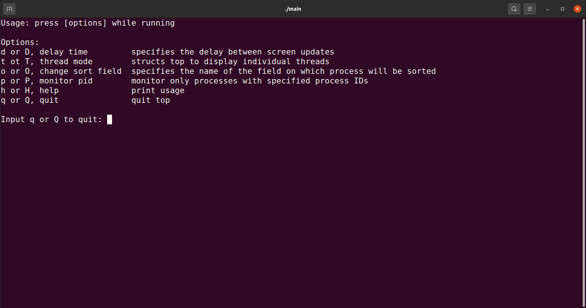
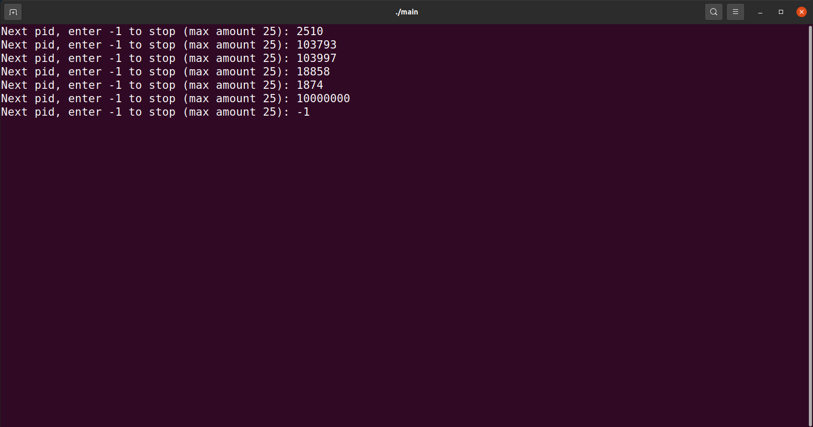

# Operating Instruction Document

11811535 Enhuai Liu 11811535 Shangxuan Wu

## Main Menu

Compile the program by command `g++ -o main main.cpp`, and then run the program by command `./main`. Then main menu in FIGURE 1 will be printed on the screen. Users need to follow the instructions to choose the function they want to use.

<b>FIGURE 1</b> Main Menu

## Real-time Statistics of Memory Usage

After entering `m` or `M`, real-time memory information will be printed on the screen. A prompt for user appears after pressing `h` or `H` key, which is shown in FIGURE 2.

<b>FIGURE 2</b> Help Page

We provide detailed operation guidance in the interaction, and users can use functions easily following the guidance after pressing corresponding keys. FIGURE 3 is an example of pressing `p` of `P`.

<b>FIGURE 3</b> Monitor Example

After the experience is complete, users can press `q` or `Q` to return to the main menu.

## Detection of Memory Allocation and Release

## Detection of Memory Leaks