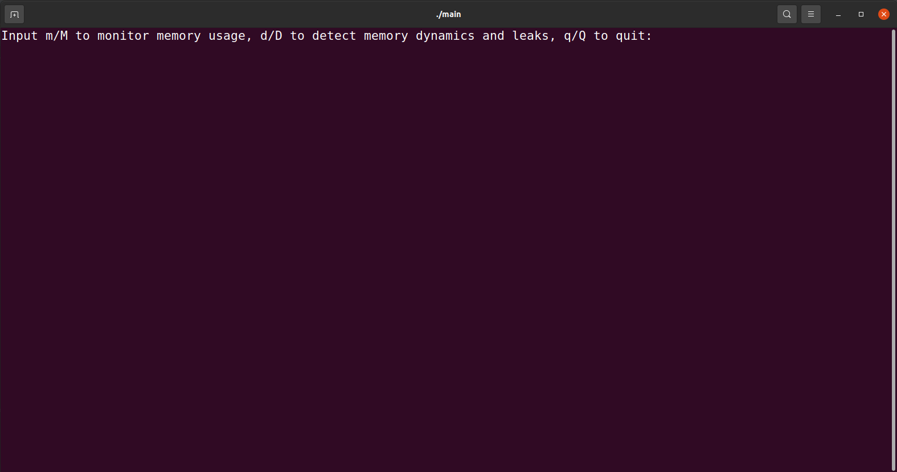

# Operating Instruction Document

<div align=center>11811535 Enhuai Liu<br>11811535 Shangxuan Wu</div>

## Before start

Run these commands:

```shell
cd task2
gcc memtrace_2.c -g -fPIC -shared -rdynamic -o libmem.so -Wl,-Map,mem.map
```

## Main Menu

Compile the program by command `g++ -o main main.cpp`, and then run the program by command `./main`. Then main menu in FIGURE 1 will be printed on the screen. Users need to follow the instructions to choose the function they want to use.



<center><b>FIGURE 1</b> Main Menu</center>

## Real-time Statistics of Memory Usage

After entering `m` or `M`, real-time memory information will be printed on the screen. A prompt for user appears after pressing `h` or `H` key, which is shown in FIGURE 2.


<center><b>FIGURE 2</b> Help Page</center>

We provide detailed operation guidance in the interaction, and users can use functions easily following the guidance after pressing corresponding keys. FIGURE 3 is an example of pressing `p` of `P`.


<center><b>FIGURE 3</b> Monitor Example</center>

After the experience is complete, users can press `q` or `Q` to return to the main menu.

## Detection of Memory Allocation, Release and Memory Leaks

After entering `d` or `D`, you should input the target C++ program name, our program will automatically compile and run it with memory detection.


If you want to find the related lines of code according to back-trace information, do it like this:

For example: find code of :./case1(main+0x4a) [0x55bf1a6b1a04]

```shell
./case1(main+0x4a) [0x55bf1a6b1a04]
```

Open case1.map, search: .text

```
*(.text .stub .text.* .gnu.linkonce.t.*)
 .text          0x00000000000008b0       0x2b /usr/lib/gcc/x86_64-linux-gnu/7/../../../x86_64-linux-gnu/Scrt1.o
                0x00000000000008b0                _start
 .text          0x00000000000008db        0x0 /usr/lib/gcc/x86_64-linux-gnu/7/../../../x86_64-linux-gnu/crti.o
 *fill*         0x00000000000008db        0x5 
 .text          0x00000000000008e0       0xda /usr/lib/gcc/x86_64-linux-gnu/7/crtbeginS.o
 .text          0x00000000000009ba       0xc4 /tmp/cc2Uinxh.o
                0x00000000000009ba                main
 *fill*         0x0000000000000a7e        0x2 
 .text          0x0000000000000a80       0x72 /usr/lib/x86_64-linux-gnu/libc_nonshared.a(elf-init.oS)
                0x0000000000000a80                __libc_csu_init
                0x0000000000000af0                __libc_csu_fini
 .text          0x0000000000000af2        0x0 /usr/lib/gcc/x86_64-linux-gnu/7/crtendS.o
 .text          0x0000000000000af2        0x0 /usr/lib/gcc/x86_64-linux-gnu/7/../../../x86_64-linux-gnu/crtn.o
 *(.gnu.warning)
```

You can find the address of function 'main'

```
 .text          0x00000000000009ba       0xc4 /tmp/cc2Uinxh.o
                0x00000000000009ba                main
```

Add 0x09ba and 0x4a, you can find the final result: 0xa04

Now run this code, you can find the result.

```shell
addr2line -e ./case1 0xa04
```

